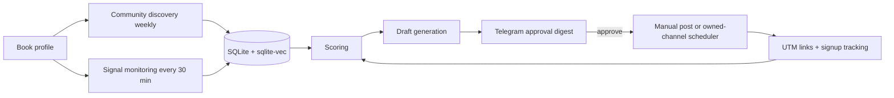

# Fan-Matching Pipeline: Build Spec

Automatically match a creative work (example: a sci-fi novel) to the communities and conversations where its fans already are, using free or near-free tools.

**Core rule:** automate research, monitoring, scoring and drafting. A human approves anything posted into someone else's community. Owned channels can be scheduled automatically.

---

## 1. Data flow



---

## 2. Stack (free-tier, permissive licenses)

| Layer | Tool | Notes |
| --- | --- | --- |
| Orchestration | Activepieces (MIT), self-hosted | Runs on Oracle Cloud Always Free VM. n8n works too but has a restrictive license. Activepieces keeps its **own** internal database (embedded PGlite for light installs, or Postgres); that is separate from the pipeline database below. |
| Database | SQLite (WAL mode) + sqlite-vec | One file on the same VM. sqlite-vec adds vector search (MIT / Apache-2.0, still 0.x, so pin the version). Back up with Litestream or a nightly `sqlite3 .backup` copy. |
| DB access layer | Small FastAPI (or similar) service that owns the SQLite file | Activepieces calls it over HTTP. This keeps a single writer and avoids sharing a file between processes. |
| Embeddings | BAAI/bge-small-en-v1.5 or bge-m3 (MIT) | Run in a small Hugging Face Space or on the VM CPU. Fine for thousands of short texts. |
| LLM | Hugging Face `InferenceClient` with an open model, plus 1-2 fallbacks | Used for profile extraction, rule summarising, intent classification and drafting. Modal serverless GPU only if you self-host a model. |
| Approval UI | Telegram bot with inline buttons (Approve / Edit / Skip) | Free, works on a phone, no frontend to build. |
| Link tracking | Cloudflare Worker redirect, or Plausible/Umami self-hosted | Needed for UTM-based attribution. |
| Reader capture | Free tier of MailerLite, Buttondown or BookFunnel | Signups are the real conversion metric. |

---

## 3. Data sources

| Source | Method | Caveats |
| --- | --- | --- |
| Reddit | Official Data API (PRAW) for subreddit search and new-post feeds; F5Bot email alerts as a zero-code backup | Check current API approval and rate-limit terms before building around it. Many subs ban self-promotion. |
| Bluesky | AT Protocol search endpoint and Jetstream for keyword and hashtag monitoring | Free and open. Good for author and reader communities, plus starter packs and feeds. |
| Mastodon | Hashtag timelines (`#scifi`, `#amreading`, `#bookstodon`) via instance API | Per-instance rate limits. |
| YouTube | Data API comment search on comp-author and book-review videos | Free quota. Shows who is already asking for recommendations. |
| Tumblr | v2 REST API tag search | Smaller but active in some fandoms. |
| Goodreads / StoryGraph | **No public API.** Maintain a manual CSV of target lists and groups. | Do not scrape. Review the CSV monthly. |
| Discord / Facebook groups | Manual discovery only. Store invite or description text in the community table. | Joining and posting is human-only. |

---

## 4. Data model (SQLite)

```sql
PRAGMA journal_mode = WAL;      -- concurrent readers while one process writes
PRAGMA foreign_keys = ON;

CREATE TABLE book_profile(
  id INTEGER PRIMARY KEY, title TEXT, blurb TEXT,
  subgenres TEXT,            -- JSON array
  themes TEXT,               -- JSON array
  tropes TEXT,               -- JSON array
  tone TEXT,
  comps TEXT,                -- JSON array
  audience_notes TEXT, updated_at TEXT
);

CREATE TABLE community(
  id INTEGER PRIMARY KEY, platform TEXT, name TEXT, url TEXT UNIQUE,
  description TEXT, rules_text TEXT,
  self_promo_policy TEXT,    -- 'banned' | 'weekly_thread' | 'allowed' | 'unknown'
  member_count INTEGER, posts_per_week REAL,
  fit_score REAL,
  status TEXT,               -- 'candidate' | 'approved' | 'rejected' | 'joined'
  last_reviewed TEXT
);

CREATE TABLE signal(
  id INTEGER PRIMARY KEY, platform TEXT,
  community_id INTEGER REFERENCES community(id),
  post_url TEXT UNIQUE, author_handle TEXT, text TEXT, created_at TEXT,
  intent_label TEXT, intent_strength REAL, seen_at TEXT
);

CREATE TABLE opportunity(
  id INTEGER PRIMARY KEY, signal_id INTEGER REFERENCES signal(id),
  score REAL, reasons TEXT,  -- JSON
  status TEXT                -- 'new' | 'drafted' | 'sent_for_approval' | 'approved' | 'posted' | 'skipped'
);

CREATE TABLE draft(
  id INTEGER PRIMARY KEY, opportunity_id INTEGER REFERENCES opportunity(id),
  channel TEXT, body TEXT, utm_url TEXT, model_used TEXT, created_at TEXT
);

CREATE TABLE outcome(
  id INTEGER PRIMARY KEY, draft_id INTEGER REFERENCES draft(id),
  clicks INTEGER, signups INTEGER, replies INTEGER, goodreads_adds INTEGER,
  notes TEXT, measured_at TEXT
);

-- Vectors: sqlite-vec virtual tables. rowid = id of the parent row.
CREATE VIRTUAL TABLE book_vec      USING vec0(embedding float[384] distance_metric=cosine);
CREATE VIRTUAL TABLE community_vec USING vec0(embedding float[384] distance_metric=cosine);
CREATE VIRTUAL TABLE signal_vec    USING vec0(embedding float[384] distance_metric=cosine);
```

Nearest-neighbour query pattern:

```sql
SELECT rowid, distance
FROM community_vec
WHERE embedding MATCH :book_vector AND k = 20;
```

**SQLite notes**

- No arrays or `jsonb`. Store lists as JSON text and filter with `json_each()`.
- One writer at a time. Route every write through the DB access service. Readers are fine under WAL.
- Vector search is brute-force. That is fast enough for thousands to low hundreds of thousands of vectors, which is far more than this pipeline needs.
- Set the embedding dimension to match your model (384 for bge-small, 1024 for bge-m3).
- If you outgrow it (many concurrent writers, millions of vectors), migrating to Postgres + pgvector is straightforward because the schema maps one-to-one.

---

## 4b. Book fingerprint

The fingerprint is the structured description of the book that every later stage matches against. It captures what the book is like to read, what it offers, who it suits and what it connects to. Matching on experience (feeling, mood, pacing, comps) separates good matches from poor ones far better than genre alone.

### Fields

| Group | Field | Shape | Example | Default weight |
| --- | --- | --- | --- | --- |
| Offer | `comps` | list | "Ancillary Justice", "Children of Time" | 0.18 |
| Experience | `feeling_after` | weighted tags | bittersweet hope 0.7, unsettled 0.3 | 0.14 |
| Experience | `mood_tone` | weighted tags | bleak 0.6, melancholic 0.4 | 0.12 |
| Experience | `pacing_structure` | object | slow-burn, character-driven, standalone, first-person, novel length | 0.10 |
| Offer | `themes_message` | weighted tags + one-line message | captivity, memory, loneliness | 0.10 |
| Offer | `tropes` | list | captive AI, unreliable narrator | 0.08 |
| Offer | `premise` | one sentence (embedded) | "A prisoner AI counts the days as rulers change." | 0.07 |
| Offer | `genre` | weighted tags | hard-sf 0.4, dystopian 0.4 | 0.06 |
| Experience | `prose_style` | list | lyrical, spare | 0.04 |
| Offer | `protagonist` | object | age, role, dynamics (underdog, found family) | 0.04 |
| Experience | `setting_aesthetic` | list | decaying empire, confinement | 0.03 |
| Experience | `sci_realism` | enum | hard / medium / soft | 0.02 |
| Context | `context_timeliness` | list | AI-ethics debate | 0.02 |
| Constraint | `content_intensity` | object | violence, sexual content, heat, flags | hard filter, no weight |
| Reader | `reader_motivation`, `age_band`, `format_habits`, `language` | tags | thinking + feeling; adult; ebook + audio; en | community-level (below) |

Weights sum to 1.0 across the weighted fields.

**Reader-side fields are matched at community level**, not per post. They live in `community_profile` and feed Stage 2 community fit, the platform ranking in 5b and the engagement mode. A community's culture (values rigor, loves new authors, bans promotion) is stored as tags in the same table.

### Example (JSON stored in `book_profile.fingerprint_json`)

```json
{
  "comps": ["Ancillary Justice", "Children of Time"],
  "comp_neighbors": ["The Left Hand of Darkness", "A Memory Called Empire"],
  "feeling_after": [{"tag": "bittersweet hope", "w": 0.7}, {"tag": "unsettled", "w": 0.3}],
  "mood_tone": [{"tag": "bleak", "w": 0.6}, {"tag": "melancholic", "w": 0.4}],
  "pacing_structure": {"pace": "slow-burn", "driver": "character", "form": "standalone",
                       "pov": "first-person", "length": "novel"},
  "themes_message": {"tags": ["captivity", "memory", "loneliness"],
                     "message": "Honesty is punished, but hope outlasts rulers."},
  "tropes": ["captive AI", "unreliable narrator"],
  "premise": "A prisoner AI counts the days as rulers come and go.",
  "genre": [{"tag": "hard-sf", "w": 0.4}, {"tag": "dystopian", "w": 0.4}],
  "prose_style": ["lyrical", "spare"],
  "protagonist": {"age": "n/a", "role": "prisoner AI", "dynamics": ["isolation"]},
  "setting_aesthetic": ["decaying empire", "confinement"],
  "sci_realism": "medium",
  "context_timeliness": ["AI ethics debate"],
  "content_intensity": {"violence": "moderate", "sexual_content": "none", "heat": 0,
                        "flags": ["imprisonment", "political oppression"]},
  "reader": {"motivation": ["thinking", "feeling"], "age_band": "adult",
             "format_habits": ["ebook", "audio"], "language": "en"}
}
```

### Schema (SQLite)

```sql
-- Controlled vocabulary, so "bleak", "grim" and "dark" resolve to one tag
CREATE TABLE tag_vocab(
  field TEXT, tag TEXT, synonyms TEXT,   -- JSON array
  PRIMARY KEY(field, tag)
);
CREATE VIRTUAL TABLE tag_vec USING vec0(embedding float[384] distance_metric=cosine);
-- tag_vec rowid = tag_vocab rowid; used for fuzzy tag matching

CREATE TABLE book_fingerprint(
  book_id INTEGER REFERENCES book_profile(id),
  field TEXT, tag TEXT, weight REAL,
  PRIMARY KEY(book_id, field, tag)
);

CREATE TABLE community_profile(
  community_id INTEGER REFERENCES community(id),
  field TEXT, tag TEXT, weight REAL,
  PRIMARY KEY(community_id, field, tag)
);

CREATE TABLE field_weight(
  field TEXT PRIMARY KEY, weight REAL,
  source TEXT                            -- 'default' | 'manual' | 'fitted'
);

ALTER TABLE book_profile ADD COLUMN fingerprint_json TEXT;
```

### How the match is computed

For each post, Stage 3 extracts an **ask fingerprint**: the same schema, but only the fields the poster actually mentions or implies, plus any exclusions ("no graphic violence").

```
for each field f present in the ask:
    overlap_f = best match between ask tags and book tags
                exact tag or listed comp           -> 1.0
                comp in book.comp_neighbors        -> 0.7
                other tags: cosine of tag vectors  -> counted only if >= 0.75

fingerprint_match = sum(field_weight[f] * overlap_f) / sum(field_weight[f])
                    # over fields present in the ask, so unmentioned fields do not penalise

if fewer than 2 fields are present:   fingerprint_match = min(fingerprint_match, 0.5)
                    # vague asks ("any good sci-fi?") must not score high

if ask.exclusions conflict with book.content_intensity: drop the opportunity
```

---

## 5. Pipeline stages

### Stage 0: One-time setup

1. Write `book_profile` by hand: blurb, 5-10 comp titles and authors, tone, themes.
2. Run the LLM profile extractor (Stage 1) and review the output.
3. Create a UTM scheme: `utm_source=<platform>&utm_medium=organic&utm_campaign=<book-slug>&utm_content=<community-or-post-id>`.

### Stage 1: Fingerprint extraction (on change)

- **Input:** blurb, 3 excerpts, and optionally review text for the comp titles.
- **Vocabulary mining (optional but high value):** collect how readers describe your comps, using the YouTube comments API, Reddit threads you can read through the official API, and review exports you provide yourself. Do not scrape Goodreads. Cluster the phrases ("bleak", "unputdownable", "made me rethink...") and add them to `tag_vocab` as synonyms.
- **LLM output (JSON):** the full fingerprint from section 4b, using tags from `tag_vocab` where possible and proposing new tags otherwise. Also output `comp_neighbors` (about 20 titles readers treat as similar to your comps) and `reader_would_say` (3 sentences a fan might type when asking for a recommendation).
- **Human review:** you check and edit the fingerprint once. It is the foundation for everything downstream.
- Write rows to `book_fingerprint`, the JSON to `book_profile.fingerprint_json`, and embed the blurb, the `reader_would_say` lines, the premise and the comps list. Store the averaged vector in `book_vec`.

### Stage 2: Community discovery (weekly)

1. **Seed queries:** comp authors, subgenres and tropes. Example: "books like The Expanse", "hard sci-fi book club", "solarpunk readers".
2. Search each platform for communities, hashtags and lists matching the seeds.
3. Pull the description and rules text. Embed the description.
4. LLM reads the rules and returns `self_promo_policy` plus a one-line summary of what the community discusses.
5. Compute `fit_score = 1 - distance(community_vec, book_vec)` (cosine similarity via sqlite-vec). Keep candidates above about 0.55 (tune on real data).
6. Push the top candidates to Telegram for a one-tap approve or reject. Only `approved` communities enter monitoring.

### Stage 3: Signal monitoring (every 15-60 min)

1. For each approved community, fetch new posts. Also run global keyword and hashtag searches such as "books like", "recommend sci-fi", "just finished" and comp-author names.
2. Dedupe by `post_url`. Embed the text and discard anything below a loose similarity floor to save LLM calls.
3. **LLM classifier** returns JSON:

```json
{
  "intent": "asking_recommendation | discussing_comp | sharing_review | off_topic",
  "intent_strength": 0.0,
  "book_is_genuine_answer": true,
  "ask_fingerprint": {"comps": [], "mood_tone": [], "pacing_structure": {}, "tropes": []},
  "exclusions": ["graphic violence"],
  "reason": "one sentence"
}
```

`ask_fingerprint` uses the section 4b schema and includes only fields the poster mentions or implies. Leave unmentioned fields out rather than guessing. 4. Store only `book_is_genuine_answer = true` signals as opportunities.

### Stage 4: Scoring

```
semantic_fit = 0.6 * fingerprint_match     # section 4b
             + 0.4 * embedding_similarity  # post vs book_vec

score = 0.35 * semantic_fit
      + 0.25 * intent_strength
      + 0.15 * freshness            # decays over ~48 h
      + 0.15 * community_receptivity # promo policy + past outcomes
      + 0.10 * size_sweet_spot       # mid-size, active communities rank highest
```

- Store the per-field overlaps in `opportunity.reasons` so each suggestion explains itself ("matched comp, mood, pacing").
- Hard filters: skip any community with `self_promo_policy = banned`, skip a post if you replied in that community in the last 7 days, and drop posts whose exclusions conflict with the book's `content_intensity`.
- Surface only opportunities above 0.65, capped at 5 per day.

### Stage 5: Draft generation

LLM prompt inputs: the post text, community rules summary, book profile, and a tone guide.

Constraints to put in the prompt:

- Answer the person's actual question first. Mention the book only if it genuinely fits.
- Name 1-2 comp titles and say why the book is similar and different.
- Under 120 words. No marketing language. Include the link only where the community allows it.
- Output two variants: one with the link, one without.

Add an **owned-channel** content type: worldbuilding questions, lore threads, short hook posts and serialized chapter excerpts for your own Bluesky, Mastodon and newsletter. These can be scheduled automatically.

### Stage 6: Human approval

- Daily digest to Telegram: community, post link, score, reason, draft.
- Buttons: **Approve**, **Edit**, **Skip**.
- Approved items go to a "to post" list with the draft ready to copy. You post manually in other people's communities.

### Stage 7: Publish

- **Owned channels:** automatic via Activepieces schedulers.
- **Other communities:** manual only. Mark as `posted` and paste the link back to the bot so the pipeline can track it.

### Stage 8: Measure and feed back

- Weekly job: pull click and signup counts by `utm_content`, then write them to `outcome`.
- Update `community_receptivity` per community from replies, upvotes, clicks and signups.
- Down-rank communities with zero response after 3 attempts. Up-rank the ones that convert.
- **Tune the field weights.** Once you have roughly 50 or more outcomes, fit a simple logistic regression of conversion on the per-field overlaps stored in `reasons`, and write the result to `field_weight` with `source = 'fitted'`. Review it before it goes live. With less data, keep the defaults, and let `manual` always override `fitted`.

---

## 5b. Platform and community recommender (genre + message)

**Goal:** given a book's genres and its central message, output a ranked channel plan: which platforms, which communities on each, and *how* to show up there.

**Inputs (a subset of the book fingerprint in section 4b):**

```json
{
  "genres": [{"tag": "hard-sf", "weight": 0.6}, {"tag": "dystopian", "weight": 0.3}],
  "themes": ["AI consciousness", "surveillance", "loneliness"],
  "message": "one sentence on what the book is saying",
  "tone": "bleak but hopeful",
  "audience": "adult, literary-leaning SF readers",
  "assets": ["text excerpts", "cover art", "short videos"]
}
```

**Two curated maps drive the matching** (YAML in the repo, versioned, reviewed monthly):

- `genre_map`: genre tag → seed communities, hashtags, comp authors, platform affinity. Answers "where do readers of this shelf gather?"
- `theme_map`: theme tag → communities that care about the *idea*, even if they are not book communities. Answers "who would be moved by this message?"

### Starter genre map (seeds for discovery only)

| Genre | Best-fit platforms | Seed communities and tags |
| --- | --- | --- |
| Hard SF / space opera | Reddit, Bluesky, Mastodon, Goodreads lists, YouTube book channels | r/printSF, r/sciencefiction, subreddits for your comp series, #scifi, #bookstodon |
| Cyberpunk / dystopian | Reddit, TikTok / Shorts (aesthetic visuals), Discord | r/cyberpunk, #cyberpunk, dystopian reading lists |
| Solarpunk / climate fiction | Mastodon, Bluesky, Substack | r/solarpunk, #solarpunk, #clifi |
| LitRPG / progression | Royal Road, Reddit | r/litrpg, r/ProgressionFantasy, Royal Road forums |
| Fantasy | Reddit, BookTok, Bookstagram | r/Fantasy (weekly self-promo thread), #fantasybooks |
| Romance / romantasy | BookTok, Bookstagram, Instagram | r/RomanceBooks, #romantasy |
| Horror / psychological | Reddit, YouTube narration, TikTok | r/horrorlit, r/nosleep (original stories, no ads) |
| Short sci-fi | Reddit, Substack | r/HFY (fiction sharing), Substack Notes |
| Literary / speculative | Substack, Bluesky, Goodreads groups | r/books, #amreading |

**High-intent sources for any genre:** recommendation-request threads such as r/suggestmeabook, r/whatsthatbook and r/books. These feed Stage 3 monitoring directly.

### Starter theme map

| Theme / message | Where people care about the idea |
| --- | --- |
| AI, consciousness, ethics | Futurism and AI-discussion communities (e.g. r/Futurology, r/artificial), AI-ethics newsletters |
| Climate, ecology | r/solarpunk, climate-fiction hashtags, environmental newsletters |
| Surveillance, authoritarianism | Digital-rights and privacy communities, dystopia reading lists |
| Loneliness, grief, identity | Literary-fiction reading groups, philosophy book clubs (e.g. r/PhilosophyBookClub) |
| Space and science | Astronomy and science-communication communities |
| Power, class, economics | Politics-in-fiction and history-literature reading groups |

### Platform ranking

```
platform_score = sum(genre_weight * platform_genre_affinity)   # normalised 0-1
               + 0.25 * format_fit        # video -> TikTok/Shorts; text -> Reddit/Substack/Royal Road
               + 0.15 * promo_friendliness # from rules summaries
               + 0.10 * effort_efficiency  # reach per hour of your time
```

Return the top 3 platforms.

### Engagement mode per community

Derived from the rules summary and stored in `community.engagement_mode`:

| Mode | Meaning |
| --- | --- |
| `participate` | Join discussions as a reader or author. No promotion. |
| `promo_thread` | Post only in the designated self-promo thread. |
| `respond_to_request` | Reply only to genuine recommendation requests. |
| `owned_content` | Post original content (excerpts, lore, art) where creators are expected. |
| `serialize` | Publish chapters on a serial platform (Royal Road, Wattpad, Substack). |

### Output: channel plan card

For each of the top 3 platforms: content types, cadence, target communities with their engagement mode, and one starter post idea per community. Deliver it to Telegram or as a markdown file.

### Schema additions

```sql
ALTER TABLE community ADD COLUMN genre_tags TEXT;       -- JSON array
ALTER TABLE community ADD COLUMN theme_tags TEXT;       -- JSON array
ALTER TABLE community ADD COLUMN engagement_mode TEXT;

CREATE TABLE platform_profile(
  platform TEXT PRIMARY KEY,
  genre_affinity TEXT,       -- JSON, e.g. {"hard-sf": 0.8, "romance": 0.2}
  formats TEXT,              -- JSON array
  promo_friendliness REAL,
  notes TEXT
);
```

### Keeping it honest

- The maps are **seeds, not truth.** Stage 2 still validates each community's activity and rules, and a community enters monitoring only after you approve it.
- Communities rename, close and change rules. Review both maps monthly.
- Never let a community's presence in the map imply permission to promote there. The engagement mode decides that.

---

## 6. Prompt skeletons

**Intent classifier (system):**

> You judge whether a social post is a genuine opening to recommend a specific book. Given the book profile and the post, return only JSON. Mark `book_is_genuine_answer` true only if a reasonable reader would find the book a helpful, on-topic answer. Be strict: when in doubt, false.

**Draft writer (system):**

> You write short, honest replies as the book's author. Follow the community rules provided. Lead with real help. Never exaggerate. If the book is not a good fit, return `{"skip": true}`.

---

## 7. Guardrails

- Never auto-post, auto-DM or auto-join in third-party communities. Platform terms and community rules change, and bans are hard to reverse.
- Re-read each community's rules before first posting. Respect weekly self-promo threads.
- Disclose AI assistance where a community expects it.
- Don't scrape platforms without an API. Use official APIs or manual lists.
- Keep a rate limit of 5 outreach drafts per day and 1 post per community per week.
- Log every action so you can audit what went out.

---

## 8. Build order

| Milestone | What you get | Effort |
| --- | --- | --- |
| **M1** | Book profile + F5Bot / Bluesky keyword alerts feeding a Telegram digest (no embeddings yet) | A weekend |
| **M2** | SQLite + sqlite-vec behind a small DB access service, book fingerprint extraction, embeddings, LLM intent classifier with ask fingerprint, scoring | 3-4 days |
| **M3** | Weekly community discovery with rules summarisation and approval buttons | 2-3 days |
| **M4** | Draft generation with variants, UTM redirect, outcome table | 2 days |
| **M5** | Owned-channel scheduler, weekly feedback loop, per-community receptivity | 2-3 days |

**Start with M1.** If the alerts alone surface a few real "books like X" threads a week, the rest of the pipeline is worth building.

---

## 9. Cost estimate

- Oracle Cloud Always Free VM, SQLite, Activepieces, Telegram bot, Cloudflare Worker: **free**
- Embeddings on CPU: **free**
- LLM calls (classifier + drafts at about 100-300 posts/day): low, and covered by free inference tiers or a few hundred rupees per month depending on model
- Email tool: free tier until the list grows